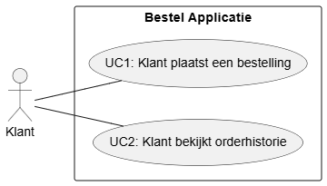

# KE03_INTDEV_SE_1_Base

Dit project is een startpunt voor de eerste inleveropdracht voor alle studenten die het keuzevak Interface Development hebben gekozen. Dit project is een Razor Pages gebaseerde web applicatie inclusief een data access layer.

# Functionele Requirements
| Code | Requirement                                                            | MoSCoW      |
| ---- | ---------------------------------------------------------------------- | ----------- |
| KR1  | Klant selecteerd meerdere producten om te bestellen                    | Must Have   |
| KR2  | Klant ziet wat hij eerder bestelt heeft                                | Must Have   |
| KR3  | Klant ziet wat de producten kosten                                     | Should have |
| KR4  | Klant weet of de bestelling succesvol is                               | Cloud have  |
| KR5  | Klant besteld een product meerdere keren                               | Must Have   |
| KR6  | Klant ziet een lijst van beschikbare producten in.                     | Must have   |
| KR7  | Klant geeft per product een gewenste hoeveelheid op                 | Must have   |
| KR8  | Klant bekijkt per bestelling de orderhistie met order details          | Must have   |

# Non-Functionele Requirements
| Code | Requirement                                                                           | MoSCoW    |
| ---- | ------------------------------------------------------------------------------------- | --------- |
| NKR1 | De UI past zich aan aan verschillende schermformaten (responsive design)              | Must have |
| NKR2 | De applicatie maakt gebruikt van meerdere HTML-elementen en toegepaste CSS-stijlen    | Must have |

# Randvoorwaarde
- De applicatie is gebouwd met ASP.NET Core Razor Pages.
- De applicatie past HCI-ontwerpprincipes toe
- De broncode is via meerdere commits beschikbaar op een persoonlijke GitHub-repository
- De applicatie maakt gebruik van de meegeleverde data access layer

# Usecases 
1. Klant plaatst een bestelling
2. Klant bekijkt orderhistorie

# Use case Beschrijvingen

| Usecase                 | UC2: Klant bekijkt orderhistorie                                                                                  |                                                                                |
| ----------------------- | ----------------------------------------------------------------------------------------------------------------- | ------------------------------------------------------------------------------ |
| Beschrijving            | Klant bekijkt orderhistorie                                                                                       |                                                                                |
| Actor                   | Klant                                                                                                             |                                                                                |
| Trigger(s)              | De klant wilt zijn eerdere bestellingen zien en navigeert naar de orderhistorie pagina                            |                                                                                |
| Pre-Conditions          | De klant bevindt zich in de applicatie                                                                            |                                                                                |
| Post-Conditions         | De klant heeft de orderhistorie en/of besteldetails ingezien. er zijn geen wijzigingen aangebracht in het systeem |                                                                                |
| Stappen                 | **Actor**                                                                                                         | **Systeem**                                                                    |
| 1                       | De klant navigeert naar de orderhistorie pagina                                                                   |                                                                                |
| 2                       |                                                                                                                   | Het systeem toont een overzicht van alle eerdere beste                         |
| 2a                      |                                                                                                                   | Het systeem toont een melding dat er nog geen bestellingen zijn geplaatst.     |
| 3                       | De klant selecteert een bestelling                                                                                |                                                                                |
| 4                       |                                                                                                                   | Het systeem toont de besteldetails, waaronder producten, hoeveelheden en prijs |
| Main succes scenario's  | 1, 2, 3, 4,                                                                                                       |                                                                                |
| Alternatieve scenario's | 1,2a                                                                                                              |                                                                                |

---

| Usecase                 | UC1: Klant plaatst een bestelling                                                                                 |                                                                             |
| ----------------------- | ----------------------------------------------------------------------------------------------------------------- | --------------------------------------------------------------------------- |
| Beschrijving            | Klant plaatst een bestelling                                                                                      |                                                                             |
| Actor                   | Klant                                                                                                             |                                                                             |
| Trigger(s)              | De klant wilt een of meerdere producten bestellen en navigeert naar de bestelpagina                               |                                                                             |
| Pre-Conditions          | De klant bevindt zich op de bestelpagina en er zijn producten beschikbaar                                         |                                                                             |
| Post-Conditions         | De bestelling is opgeslagen in het systeem en verschijnt in de orderhistorie                                      |                                                                             |
| Stappen                 | **Actor**                                                                                                         | **Systeem**                                                                 |
| 1                       | De klant opent de bestelpagine                                                                                    |                                                                             |
| 2                       |                                                                                                                   | Het systeem toont een lijst van beschikbare producten met prijzen           |
| 2a                      |                                                                                                                   | 2a het systeem toont dat er geen producten beschikbaar zijn                 |
| 3                       | De klant selecteert een product en geeft een hoeveelheid op                                                       |                                                                             |
| 3a                      |                                                                                                                   | het systeem toont een foutmelding als de opgegeven hoeveelheid ongeldig is. |
| 4                       | De klant herhaalt stap 3 voor eventuele extra producten                                                           |                                                                             |
| 5                       | De klant bevestigt de bestelling                                                                                  |                                                                             |
| 6                       |                                                                                                                   | Het systeem slaat de bestelling op en toont een bevestigingsmelding         |
| Main succes scenario's  | 1, 2, 3, 4, 5, 6                                                                                                  |                                                                             |
| Alternatieve scenario's | 1,2a 1,2,3a                                                                                                    |                                                                             |

# Use case diagram
